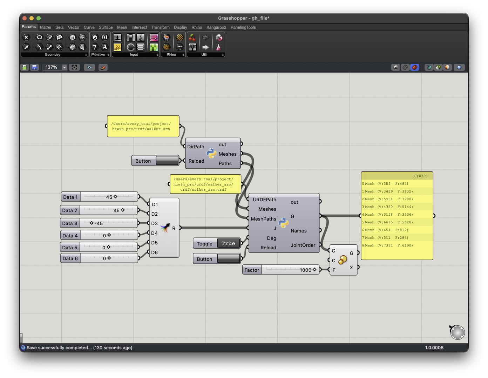
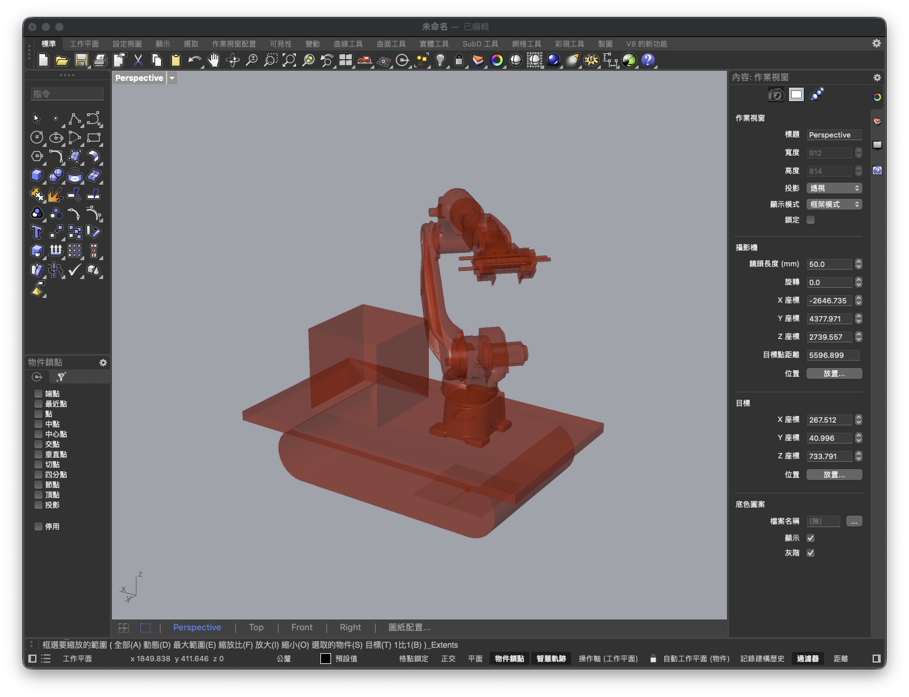

# hiwin_prc

hiwin_prc 用於串接 hiwin_rak 機器人控制系統，用於直接將 Rhino/Grasshopper 中的點位輸出至 ROS 環境中控制。

## 資料格式

### 運動模式

#### axis
{"motion_type": "axis", "joint1": 45.0, "joint2": 0.0, "joint3": 0.0, "joint4": 180.0, "joint5": 0.0, "joint6": -180.0}

#### moveJ
{"motion_type": "moveJ", "x": -1.0, "y": 0.0, "z": 0.5, "roll": 0.0, "pitch": 0.0, "yaw": 90.0}

#### moveL
{"motion_type": "moveL", "x": -1.0, "y": 0.0, "z": 0.8, "roll": 0.0, "pitch": 0.0, "yaw": 90.0}

### DO/等待

#### wait_time
{"wait_time": 5.0}

#### DO
{"DO": 0, "state": "on"}

## 範例
```
{"motion_type": "axis", "joint1": 45.0, "joint2": 0.0, "joint3": 0.0, "joint4": 180.0, "joint5": 0.0, "joint6": -180.0}
{"DO": 0, "state": "on"},
{"motion_type": "moveJ", "x": -1.0, "y": 0.0, "z": 0.5, "roll": 0.0, "pitch": 0.0, "yaw": 90.0}
{"wait_time": 5.0},
{"motion_type": "moveL", "x": -1.0, "y": 0.0, "z": 0.8, "roll": 0.0, "pitch": 0.0, "yaw": 90.0}
```

# Grasshopper URDF Robot Viewer 




